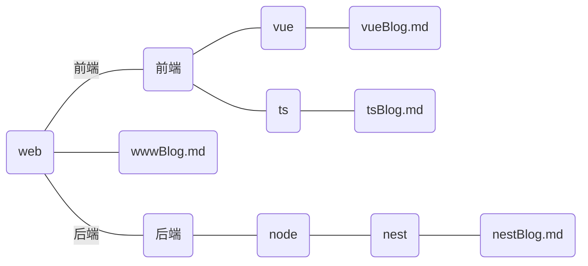

# 使用说明

**从博客网站导出 .md 的整个文件夹经过处理后可以直接将文件夹放入 hexo/source/\_posts/ 下**<br />
**如果第一次执行后文件内容跟预期有出入，不要改动文件内的 prefix 也就是处理后新新加的内容！！！，可以通过再执行一次抹除添加的 prefix**

## 安装

拉取代码

```
git clone https://github.com/1099571219/hexo-prefix-fixer.git
```

## 脚本说明

有做路径兼容，win，mac，linux 都能用<br />
将 prefix-fixer.cjs 脚本放到需要处理的博客文件夹的根目录中,比如:<br>
将 prefix-fixer.cjs 放到 web 文件夹中,然后执行即可，会对 web 下的所有文件进行处理，当然了，会跳过 .md 以外的文件<br>
执行后 wwwBlog.md 的 title 会被设置为 wwwBlog ，categories: [web] ，tag: web<br>
tsBlog.md 的 title 为 tsBLog ， categories: [web,前端,ts] , tag：ts



<br />

**主函数 readDir(gTitle:boolean) 的 gTitle 参数决定是否生成文章内容一级标题 subTitle**

```
 ---
title: ${title}
categories:
- [${rootDirName}]
tag: ${rootDirName[rootDirName.length - 1]}
---
${subTitle}
```

执行脚本后默认会:

- 根据文件名生成 title
- 根据脚本文件所在目录定位分类根目录
- 生成嵌套目录 categories
- 根据各个.md 文件当前目录生成 tag

其他具体内容查看源码

## 执行

打开终端执行

```
node 路径/prefix-fixer.cjs
或
node ./prefix-fixer.cjs
```
